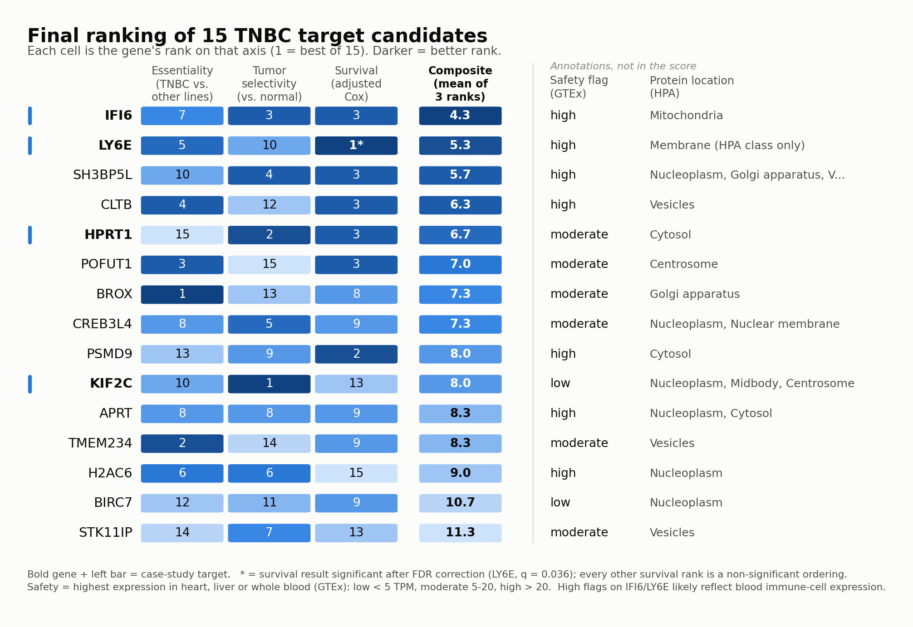

# Oncology Target Discovery: Triple-Negative Breast Cancer

## Overview
The goal of this project was to build a reproducible pipeline that combines public datasets to identify and prioritize potential therapeutic targets in triple-negative breast cancer (TNBC). Target identification is one of the earliest decisions in drug discovery, and it draws on several kinds of evidence at once: whether cancer cells depend on a gene, whether it is more active in tumor than in normal tissue, whether it is safe to hit, and whether it matters for patient outcomes. The output is a ranked list of computational hypotheses for lab follow-up, not validated targets.

## Motivation
I previously worked on preclinical target validation, and I wanted to build a project on the computational side of that same question: which targets are worth taking to the lab in the first place. I chose TNBC because it is a common cancer type with an unmet need (no estrogen receptor, progesterone receptor or HER2 to aim a targeted drug at) and because it is well studied, so there is plenty of public data and published literature to check results against. This project uses public data and public reasoning only.

I also wanted to see how public datasets are combined end to end, where each one can mislead, and how a ranking should be checked against known biology before anyone believes it. Several of the most useful moments in this project were catching a result that looked convincing and was wrong, and each one is recorded in `NOTES.md`.

## Datasets
Four public sources, each covering a different part of the question:
- **DepMap 26Q1** (Chronos CRISPR gene-effect scores and cell-line metadata): which genes each cell line needs to survive. 25 TNBC cell lines have CRISPR data, compared against 1,181 other lines.
- **TCGA-BRCA** (GDAC Firehose, 2016-01-28 run): tumor and matched-normal RNA-seq expression, receptor status and survival for 1,097 patients.
- **GTEx v11** (median TPM across 68 tissues): normal-tissue expression, used as a safety check on heart, liver and blood.
- **Human Protein Atlas 25.1**: protein class and subcellular location, as a druggability annotation.

## Approach
TNBC was defined explicitly, twice, and never silently swapped for "all breast cancer." For cell lines, DepMap's `ModelSubtypeFeatures` label picks 34 breast lines (25 with CRISPR data). For patients, TCGA receptor status picks cases that are ER-negative, PR-negative and HER2-negative, using the standard clinical rule that an equivocal HER2 test defers to the FISH result. That gives 143 of 1,097 patients (13%, matching clinical prevalence). Lines or patients with missing status are excluded from both groups rather than assumed to be non-TNBC.

Candidates then moved through four stages. **Selective essentiality:** a Mann-Whitney U test per gene compared dependency in TNBC lines against all others, with Benjamini-Hochberg FDR correction. **Tumor selectivity and safety:** TCGA tumor vs. matched-normal breast fold change, plus a GTEx flag for expression in critical organs. **Clinical relevance:** Kaplan-Meier with log-rank tests, and Cox regression adjusted for age and stage, on the 142 TNBC patients with expression data. **Composite score:** the three evidence axes (essentiality, tumor selectivity, survival) were rank-averaged with equal weight. Safety and druggability sit beside the score as annotations, because a hard safety filter would have removed two of the top three candidates on what is likely a circulating-immune-cell artifact.

The pipeline was also checked against known biology before any candidate was trusted. That check found the raw shortlist was contaminated with genes every cell needs and with a Y-chromosome artifact, and both were filtered out. Literature searches then checked the top candidates against outside evidence.

## Repository Structure
```
├── notebooks/
│   ├── 01_data_eda.ipynb                    # Week 1: dimensions, missingness, distributions per source
│   ├── 02_selective_essentiality.ipynb      # Week 2: TNBC-selective dependency + plausibility filters
│   ├── 03_tumor_selectivity_safety.ipynb    # Week 3: tumor vs. normal, GTEx safety, HPA druggability
│   └── 04_survival_analysis.ipynb           # Week 4: KM/Cox survival, composite score, 5-axis comparison
├── src/
│   └── data_utils.py                        # loaders + the TNBC cell-line and patient definitions
├── scripts/
│   ├── download_tcga.py                     # scripted TCGA-BRCA download
│   ├── download_gtex.py                     # scripted GTEx download
│   └── make_summary_figure.py               # builds results/summary_figure.png
├── data/
│   ├── raw/                                 # original downloads, not tracked in git
│   └── processed/                           # named result tables (final ranking, survival, etc.)
├── results/
│   └── summary_figure.png                   # README figure, made by scripts/make_summary_figure.py
├── NOTES.md                                 # decisions, problems found and fixed, case studies
├── CLAUDE.md                                # running project log / status
├── case_study_research.md                   # literature + druggability research for the case studies
├── environment.yml                          # conda environment, every direct dependency pinned
└── environment.lock.txt                     # full pip freeze (incl. transitive deps), from macOS
```

## Setup
```bash
conda env create -f environment.yml
conda activate target-discovery
python scripts/download_tcga.py   # TCGA-BRCA expression + clinical
python scripts/download_gtex.py   # GTEx v11 median TPM
```
`environment.yml` pins every direct dependency to an exact version. `environment.lock.txt` is the full `pip freeze` of the environment the results were produced in (macOS, Python 3.10.21); use it if you need identical transitive versions, though a few packages in it are macOS-only.

Two datasets are manual downloads. DepMap blocks scripted requests: download `Model Data.csv` and `CRISPR Gene Effect.csv` (release 26Q1) from the portal's Custom Downloads into `data/raw/depmap/`. For the Human Protein Atlas, download `proteinatlas.tsv.zip` from proteinatlas.org/download and unzip it into `data/raw/hpa/`.

Then run the four notebooks in order. Each one has its kernel saved in its metadata, so it runs under the `target-discovery` environment. If `conda activate` doesn't take effect in your shell, call the environment's Python by its full path.

## Results
The final ranking ([`depmap_tnbc_final_ranked_targets.csv`](data/processed/depmap_tnbc_final_ranked_targets.csv)) covers 15 candidates narrowed from about 18,000 genes.



Four were chosen for case studies:

| Gene | Composite rank | Median Chronos effect (TNBC) | Tumor vs. normal (log2FC) | Adjusted survival HR (q) | Safety flag |
|---|---|---|---|---|---|
| `IFI6` | 1 | -0.046 | +2.32 | 1.16 (0.79) | high |
| `LY6E` | 2 | -0.037 | +0.53 | **1.74 (0.036)** | high |
| `HPRT1` | 5 | -0.030 | +0.88 | 0.69 (0.79) | moderate |
| `KIF2C` | 9 | **-0.487** | **+3.35** | 0.95 (0.92) | low |

`LY6E` stood out statistically: it is the only candidate whose survival association holds up after multiple-testing correction, and adjusting for age and stage strengthened it. It was also independently reported in 2025 as a TNBC-specific target using different methods (RNA-seq, protein and xenograft), which makes it the clearest case of this pipeline recovering known biology. `IFI6` ranks first because it is consistently good on every axis, not because it is best on any one. `KIF2C` has by far the strongest real dependency (80% of TNBC lines dependent, versus 12% or fewer for the others) and the lowest critical-tissue expression, yet lands 9th because the composite undersells it, as described below.

## Key Findings

**The composite ranking depends on which axes are scored.** `KIF2C` is 9th overall, but on measured dependency, tumor selectivity and safety it is the best of the four. The Week 2 test only measured *differential* dependency (TNBC vs. other lineages), so it never credited how strongly TNBC lines actually need the gene, and the survival axis ranked it low because 21 deaths among 142 patients cannot detect the pooled multi-cohort association reported in the literature. Adding safety and druggability as two more axes moved `LY6E` from 2nd to a tie for 5th, purely on a likely blood-cell artifact. The ranking is an ordering to reason from, not a verdict.

**The raw shortlist looked convincing and was wrong.** It was full of genes every cell needs (`SNRPF`, `POLR3A`, `PSMA5`) and a Y-linked gene (`AMELY`) that scored as "TNBC-essential" only because the TNBC group is entirely female and the comparison group is mostly male. Filtering on pan-cancer mean effect and on real expression in TNBC tumors fixed both. The plausibility check was worth more than the statistics.

**Labels overstate tractability, and two candidates disagree with the literature.** HPA labels `HPRT1` an "FDA approved drug target," but the approved drugs (thiopurines) need `HPRT1` to be activated and no approved drug inhibits it. HPA's "membrane protein" label for `IFI6` hides that it sits in the inner mitochondrial membrane, not on the cell surface. And the largest published breast-cancer analysis of `IFI6` found no significant TNBC association, which this project's TNBC-specific evidence does not agree with. That gap is stated, not smoothed over. The four case studies, with next experimental steps, are in `NOTES.md` under "Case studies."

## Future Work
An interactive gene explorer (essentiality, expression and survival for any gene) is a natural addition. The larger limits are scientific rather than technical: the survival analysis is underpowered, bulk RNA-seq cannot separate tumor cells from infiltrating immune cells, and the TCGA release is from 2016. The real next step is experimental: IHC on a tissue microarray and knockdown in TNBC cell lines, as laid out for each candidate in `NOTES.md`.

## Acknowledgments
- [DepMap](https://depmap.org/), [TCGA / GDAC Firehose](https://gdac.broadinstitute.org/), [GTEx](https://gtexportal.org/) and the [Human Protein Atlas](https://www.proteinatlas.org/) for the public data this project is built on.
- [pandas](https://pandas.pydata.org/), [SciPy](https://scipy.org/) and [lifelines](https://lifelines.readthedocs.io/): the core tooling for the statistics and survival analysis.
- Built with [Claude Code](https://claude.com/claude-code) as a pair-programming/teaching tool throughout.
